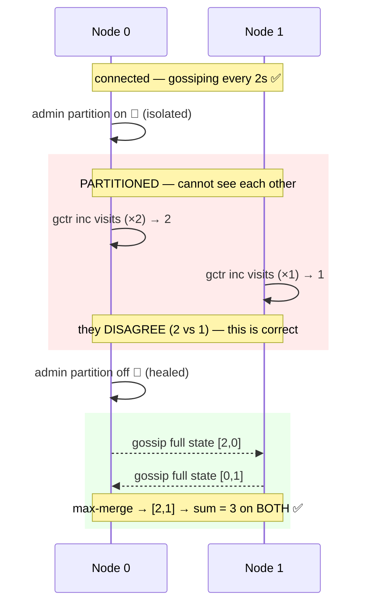
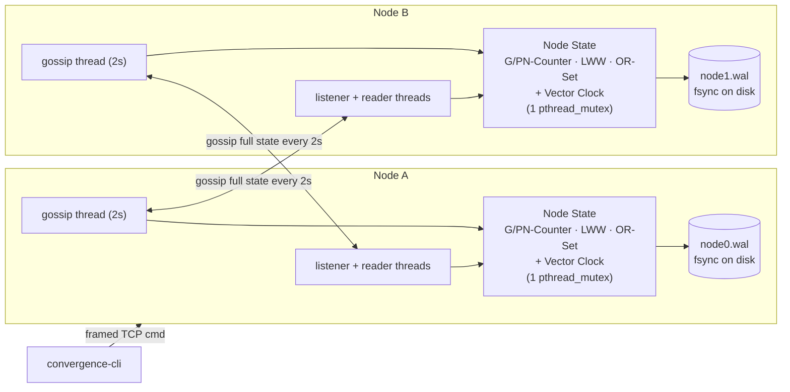
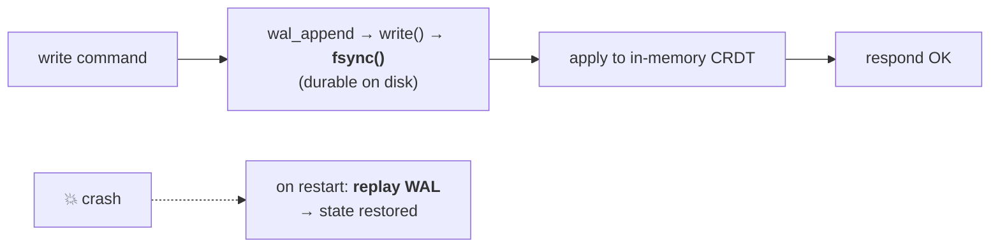

<div align="center">

# 🌀 Convergence

### A coordinator-free distributed key-value store in C that syncs **conflict-free** after network partitions.

*Nodes go offline, keep accepting writes independently, reconnect — and arrive at the **exact same state**. No leader. No lost writes. Convergence guaranteed by math.*


-success)


</div>

---

```bash
make        # build the node + CLI
make test   # run all unit + integration tests
make demo   # partition → diverge → heal → converge  (no sudo)
make bench  # print throughput / memory / latency
```

---

## 📑 Table of Contents

- [The 30-second idea](#-the-30-second-idea)
- [The problem](#-the-problem)
- [Live demo](#-live-demo)
- [Architecture](#%EF%B8%8F-architecture)
- [The four CRDTs](#-the-four-crdts)
- [Wire protocol](#-wire-protocol)
- [Durability (WAL)](#-durability-write-ahead-log)
- [Design decisions](#-design-decisions)
- [Benchmarks](#-benchmarks)
- [Roadmap](#%EF%B8%8F-roadmap-what-id-improve)
- [Project structure](#-project-structure)
- [Build & run](#-build--run)
- [Learn more](#-learn-more)

---

## 💡 The 30-second idea

Two servers hold `visits = 10`. The network splits them:

| | Node A | Node B |
|---|---|---|
| writes during split | `+2` | `+1` |
| each believes | `12` | `11` |

A naive "last write wins" system keeps **one** number and **loses** the other —
silent data loss. Convergence keeps both nodes available, then merges to the
**correct `13`** after they reconnect, because every value is a **CRDT** — a data
type whose merge can't lose data and doesn't depend on order.

> **One line:** *Coordinator-free replicated KV store. Nodes gossip their state
> and merge it with CRDTs, so they converge after partitions — no leader, no
> conflict-resolution code, no consensus.*

---

## 🎯 The problem

The hard part of replication isn't moving data — it's **deciding what happens
when two replicas disagree**. Three classic non-solutions and what Convergence
does instead:

| Naive approach | Why it fails | Convergence's answer |
|---|---|---|
| A single leader decides | Leader down ⇒ writes refused (not available) | No leader — every node accepts writes |
| Wall-clock "last write wins" | Clock drift ⇒ fastest clock wins, not latest writer | **Vector clocks** track causality, not time |
| Lock / coordinate every write | Impossible during a partition | **CRDT merge** needs no coordination |

The result is an **AP** system (per the CAP theorem): **A**vailable +
**P**artition-tolerant, **eventually consistent**.

---

## 🎬 Live demo

`make demo` runs the whole story. It simulates the split with an in-app
`admin partition` command — **no `sudo`/iptables**, fully deterministic.



Actual output:

```text
=== Writing during the partition ===
    Node 0 sees visits = 2
    Node 1 sees visits = 1          ← they disagree; the partition is real
=== Healing the partition ===
    Node 0 sees visits = 3
    Node 1 sees visits = 3          ← converged, one gossip cycle later
=== DEMO PASSED: both nodes converged to 3 ===
```

---

## 🏗️ Architecture

Every node both **listens** (for peers + CLI) and **dials** its peers. Every 2s
it gossips its full state; on receipt it merges. One mutex guards all state.



**Threads per node:**

| Thread | Job |
|---|---|
| `main` | parse args → replay WAL → start the others |
| `listener` | `accept()` loop; spawns one reader per connection |
| `reader` (per conn) | receive framed messages, dispatch (merge state / run command) |
| `gossip` | every 2s: dial peers, send heartbeat + full state |

---

## 🧩 The four CRDTs

Every value is one of these. Each has the same shape: `init` → local mutators →
`value` → **`merge`** (commutative, associative, idempotent).

| CRDT | Commands | How merge works | Guarantee |
|---|---|---|---|
| 🔢 **G-Counter** | `gctr inc / get` | element-wise **max** of per-node slots | increments never lost |
| ➕➖ **PN-Counter** | `pctr inc / dec / get` | two G-Counters; value = **P − N** | inc **and** dec (may go negative) |
| 📝 **LWW Register** | `reg set / get` | keep **causally-later** write; concurrent ⇒ higher node id | deterministic last-writer-wins |
| 🏷️ **OR-Set** | `set add / rm / list` | **union** of add-tags & remove-tombstones | **add-wins** on concurrent add/remove |

<details>
<summary><b>Why G-Counter merge is just <code>max</code></b> (click to expand)</summary>

Each node owns one slot and only ever increments **its own**. Counts only grow,
so the max of a slot across replicas is always the freshest count from its owner —
`max` can never drop an increment. Value = sum of slots.

```
Node 0 offline: [3,0]      Node 1 offline: [0,2]
merge → [3,2]  → value 5   ·  merge other way → [3,2]  (commutative)  ·  merge twice → [3,2]  (idempotent)
```
</details>

<details>
<summary><b>OR-Set "add-wins" — the tricky one</b> (click to expand)</summary>

Each `add` mints a unique tag `(node_id, seq)`. A `remove` only tombstones tags
it has **already seen**. An element is present iff it has **any** un-tombstoned tag.

```
A: add("x")  → (A,1)
B: remove("x") → tombstones (A,1)          [B had seen (A,1)]
A: add("x")  → (A,2)   ← concurrent; B never saw (A,2)

merge → added {(x,A1),(x,A2)}, removed {A1}
        (A,1) dead, (A,2) alive  →  "x" is PRESENT
```

Add-wins because a concurrent add creates a tag the remover couldn't have known
about — so it can't have meant to delete it. The alternative would silently drop
a write.
</details>

```bash
./convergence-cli --port 7000 pctr inc balance
./convergence-cli --port 7000 reg  set username alice
./convergence-cli --port 7000 set  add tags distributed
./convergence-cli --port 7000 set  list tags
```

---

## 📡 Wire protocol

No serialization library — every byte is hand-rolled and explainable. TCP is a
**byte stream**, so each message is **length-prefixed** and read in exact counts.

```text
┌─────────────────────┬──────────────┬──────────────┐
│ 4 bytes: payload_len │ 1 byte: type │  N bytes data │
└─────────────────────┴──────────────┴──────────────┘
        read exactly 5 header bytes → then read exactly payload_len bytes
```

| Byte | Message | Payload |
|---|---|---|
| `0x01` | `MSG_HEARTBEAT` | sender id |
| `0x02` | `MSG_STATE_SYNC` | full serialized state |
| `0x04` | `MSG_CLI_CMD` | command string |
| `0x05` | `MSG_CLI_RESP` | response string |

> State is serialized **field-by-field in big-endian**, *not* raw `struct` memcpy —
> so node-local identity fields never leak onto the wire and the format stays
> portable across compilers/architectures.

---

## 💾 Durability (write-ahead log)

The golden rule: **log before you apply.**



`fsync` blocks until bytes are **physically on disk** (same contract as
PostgreSQL's WAL). If the node dies after fsync, replay rebuilds the exact prior
state. Verified against a real `kill -9`.

---

## 🧠 Design decisions

| Decision | Choice | Why |
|---|---|---|
| Ordering | **Vector clocks**, not wall time | clock skew ⇒ fastest clock wins, dropping writes |
| Set semantics | **Add-wins** OR-Set | never silently discard a concurrent add |
| Replication | **Full-state gossip** (anti-entropy) | self-healing; idempotent merge ⇒ no acks/dedup/retries |
| CAP corner | **AP** (available + partition-tolerant) | refusing writes is worse than a brief stale read |
| Concurrency | **One coarse mutex** | correct + simple; tiny critical sections; profile before splitting |
| Serialization | **Explicit big-endian fields** | portable; never leaks local identity onto the wire |
| Language | **C11, POSIX only** | full control of memory/threads/bytes; zero dependencies |

---

## 📊 Benchmarks

From `make bench` (numbers vary by machine):

| Metric | Result | What it measures |
|---|---|---|
| In-memory write | **~590,000,000 ops/sec** | raw `gcounter_increment` — CPU-bound |
| **Durable** write | **~420 ops/sec** (~2.4 ms) | one `fsync` per write — disk-bound |
| Memory footprint | **~13 MB / 100k keys** (136 B/key) | per-key G-Counter cost |
| Gossip sync latency | **~1.0 s** | write on node 0 → seen on node 1 (≈ ½ the 2s cycle) |

> 🔑 **The headline result:** durable writes are **6 orders of magnitude** slower
> than in-memory ones — and that entire gap is `fsync`. Production systems close
> it with **group commit** (batch many writes per flush). That's roadmap item #1.

---

## 🛣️ Roadmap (what I'd improve)

- [ ] **Group commit** — batch many writes per `fsync` (the benchmark shows this dominates durable throughput)
- [ ] **Delta-CRDTs** — gossip only recent changes, not full state (less bandwidth)
- [ ] **Tombstone GC** — reclaim OR-Set remove-tags once known cluster-wide
- [ ] **Dynamic membership** — SWIM-style join/leave instead of static startup config
- [ ] **Hashmap key store** — lift the fixed-size key cap

---

## 📁 Project structure

```text
convergence/
├── include/            # one header per module
│   ├── vclock.h  gcounter.h  pncounter.h  lww_register.h  orset.h
│   └── net.h  wal.h  node.h  common.h
├── src/
│   ├── crdt/           # the four CRDTs + vector clock
│   │   └── vclock.c  gcounter.c  pncounter.c  lww_register.c  orset.c
│   ├── net.c           # TCP framing, listen/connect, read_all/write_all
│   ├── node.c          # ❤️ state tables · serialize/merge · WAL write-path · CLI parse
│   ├── wal.c           # append + fsync + replay
│   ├── main.c          # args · WAL replay · listener + gossip threads
│   └── cli.c           # the client binary
├── tests/              # 7 suites (unit + 2-process integration + WAL recovery)
├── bench/bench.c       # the four benchmarks
├── demo/partition_demo.sh
└── Makefile
```

> **Reading order:** `node.c` (wires everything) → `vclock.c` & `orset.c` (the
> conceptual core).

---

## 🔧 Build & run

| Command | Does |
|---|---|
| `make` | build `convergence` (node) + `convergence-cli` |
| `make test` | run all unit + integration tests |
| `make demo` | partition → heal → converge demo |
| `make bench` | print throughput / memory / latency |
| `make clean` | remove build artifacts |

Run two nodes by hand:

```bash
./convergence --id 0 --port 7000 --peer 127.0.0.1:7001 --nodes 2 --wal node0.wal &
./convergence --id 1 --port 7001 --peer 127.0.0.1:7000 --nodes 2 --wal node1.wal &

./convergence-cli --port 7000 gctr inc visits
./convergence-cli --port 7001 gctr get visits   # converges within ~2s
```

**Requirements:** `gcc` (C11) + pthreads. Nothing else.

---

## 📚 Learn more

- **[EXPLAINER.md](EXPLAINER.md)** — a full beginner-to-interview walkthrough:
  the theory (CAP, vector clocks, CRDT math) down to this repo's exact code, with
  a Q&A bank. *Start here if you want to understand, not just run.*
- **[convergence_engineering_doc.md](convergence_engineering_doc.md)** — the
  original engineering design spec.

<div align="center">

*Built to explore distributed systems from first principles — CAP, eventual
consistency, CRDTs, vector clocks, and crash-durable storage — in plain C.*

</div>
